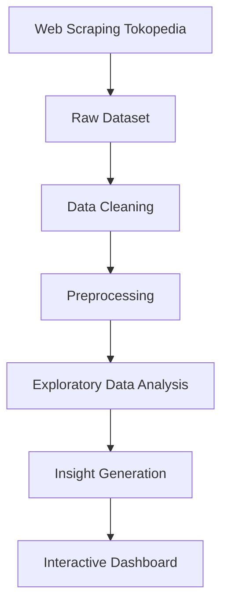

# 💻 Laptop Market Intelligence


## 📖 Deskripsi Proyek

**Laptop Market Intelligence** merupakan proyek Big Data yang bertujuan untuk mengumpulkan, mengolah, menganalisis, dan memvisualisasikan data laptop dari marketplace **Tokopedia**. Data yang diperoleh melalui proses web scraping digunakan untuk menghasilkan insight mengenai kondisi pasar laptop di Indonesia, seperti distribusi harga, popularitas merek, rating produk, dan karakteristik spesifikasi laptop.

Proyek ini dikembangkan sebagai tugas akhir mata kuliah **Big Data** Program Studi **Sains Data Universitas Pembangunan Nasional "Veteran" Jawa Timur**.

---

## 🎯 Tujuan Proyek

* Mengumpulkan data laptop dari Tokopedia menggunakan teknik web scraping.
* Melakukan preprocessing dan pembersihan data.
* Melakukan eksplorasi dan analisis data.
* Menghasilkan insight mengenai pasar laptop di Indonesia.
* Menyediakan dashboard interaktif untuk visualisasi data.

---

## 👥 Anggota Kelompok

| Nama                                  | NPM         |
| ------------------------------------- | ----------- |
| Praja Lohphinesti Subiarto            | 24083010060 |
| Gusti Jogishwara Adji                 | 24083010107 |
| Muhammad Rudmardiansyah Pratama Putra | 24083010108 |

---

# 📂 Struktur Proyek

```text
big-data-scraping-main
│
├── app.py                                # Dashboard Streamlit
├── analysis.ipynb                        # Analisis eksplorasi data
├── insight.ipynb                         # Insight dan visualisasi
├── scraping_big_data.ipynb               # Notebook scraping
├── codingan scraping tokopedia.ipynb     # Eksperimen scraping
│
├── scrape_all_brands.py                  # Scraping semua merek
├── scrape_macbook.py                     # Scraping khusus MacBook
├── generate_dashboard_project.py         # Generate dashboard
│
├── cleaned_laptops.csv                   # Dataset hasil preprocessing
├── sample_data_17-03-2026.csv            # Dataset sampel
│
├── tokopedia_acer_17-06-2026.csv
├── tokopedia_advan_17-06-2026.csv
├── tokopedia_asus_17-06-2026.csv
├── tokopedia_axioo_17-06-2026.csv
├── tokopedia_colorful_17-06-2026.csv
├── tokopedia_dell_17-06-2026.csv
├── tokopedia_gigabyte_17-06-2026.csv
├── tokopedia_hp_17-06-2026.csv
├── tokopedia_lenovo_17-06-2026.csv
├── tokopedia_macbook_17-06-2026.csv
├── tokopedia_msi_17-06-2026.csv
│
├── requirements.txt
└── README.md
```

---

# ⚙️ Teknologi yang Digunakan

### Programming Language

* Python

### Library

* Pandas
* NumPy
* Plotly
* Streamlit
* Scikit-Learn

### Tools

* Jupyter Notebook
* Google Colab
* VS Code

### Data Source

* Tokopedia

---

# 📊 Dataset

Dataset diperoleh melalui proses web scraping dari Tokopedia dengan berbagai merek laptop, antara lain:

* Acer
* Advan
* Asus
* Axioo
* Colorful
* Dell
* Gigabyte
* HP
* Lenovo
* MacBook
* MSI

### Variabel Data

Dataset mencakup informasi:

* Nama produk
* Brand
* Harga
* Rating produk
* Jumlah terjual
* Link produk
* Spesifikasi laptop
* Informasi lainnya yang tersedia pada halaman produk

---

# 🔄 Workflow Proyek



---

# 📈 Analisis Data

Analisis dilakukan melalui beberapa tahapan:

### 1. Web Scraping

Mengambil data laptop dari Tokopedia menggunakan Python.

### 2. Data Cleaning

Membersihkan data dari nilai kosong, format harga, dan atribut yang tidak konsisten.

### 3. Exploratory Data Analysis (EDA)

Mengeksplorasi distribusi data untuk memperoleh pola dan karakteristik pasar.

### 4. Insight Generation

Menghasilkan informasi penting mengenai:

* Persebaran harga laptop.
* Popularitas merek.
* Hubungan harga dengan rating.
* Produk yang paling diminati.

### 5. Dashboard Visualization

Menyajikan hasil analisis dalam dashboard interaktif berbasis Streamlit.

---

# 📊 Dashboard Features

Dashboard menyediakan beberapa fitur:

✅ KPI Market Overview

✅ Distribusi Harga Laptop

✅ Analisis Merek Laptop

✅ Perbandingan Rating Produk

✅ Visualisasi Interaktif menggunakan Plotly

✅ Filter Data

---

# 🚀 Instalasi

Clone repository:

```bash
git clone https://github.com/username/big-data-scraping.git
```

Masuk ke folder project:

```bash
cd big-data-scraping
```

Install dependencies:

```bash
pip install -r requirements.txt
```

---

# ▶️ Menjalankan Dashboard

Jalankan Streamlit:

```bash
streamlit run app.py
```

Dashboard akan tersedia pada:

```text
http://localhost:8501
```

---

# 📦 Requirements

```txt
streamlit
pandas
plotly
numpy
scikit-learn
```

---

# 📚 Dokumentasi

## Notebook

### `scraping_big_data.ipynb`

Notebook untuk proses scraping data dari Tokopedia.

### `analysis.ipynb`

Notebook untuk melakukan eksplorasi data dan analisis statistik.

### `insight.ipynb`

Notebook untuk menghasilkan insight dan visualisasi.

---

# 📑 Dashboard Interaktif 

### Dashboard 

https://rekomendasilaptopai.streamlit.app/

---

# 🎓 Mata Kuliah

**Big Data**

Program Studi Sains Data
Fakultas Ilmu Komputer
Universitas Pembangunan Nasional "Veteran" Jawa Timur

---

# 📜 License

Project ini dibuat untuk keperluan akademik dan pembelajaran pada mata kuliah **Big Data**.

---

## ⭐ Acknowledgements

Terima kasih kepada:

* Program Studi Sains Data UPN "Veteran" Jawa Timur
* Dosen Pengampu Mata Kuliah Big Data
* Tokopedia sebagai sumber data
* Seluruh anggota Kelompok 6

| Nama | NPM |
|--------|--------|
| Praja Lohphinesti Subiarto | 24083010060 |
| Gusti Jogishwara Adji | 24083010107 |
| Muhammad Rudmardiansyah Pratama Putra | 24083010108 |

---

## 📂 Struktur Project

```
big-data-scraping-main/
│
├── app.py                          # Dashboard Streamlit
├── cleaned_laptops.csv             # Dataset hasil preprocessing
├── requirements.txt                # Library yang digunakan
├── analysis.ipynb                  # Notebook analisis data
├── insight.ipynb                   # Notebook insight data
├── scraping_big_data.ipynb         # Notebook scraping
├── codingan scraping tokopedia.ipynb
├── generate_dashboard_project.py
├── scrape_all_brands.py
├── scrape_macbook.py
│
├── tokopedia_acer_17-06-2026.csv
├── tokopedia_advan_17-06-2026.csv
├── tokopedia_asus_17-06-2026.csv
├── tokopedia_axioo_17-06-2026.csv
├── tokopedia_colorful_17-06-2026.csv
├── tokopedia_dell_17-06-2026.csv
├── tokopedia_gigabyte_17-06-2026.csv
├── tokopedia_hp_17-06-2026.csv
├── tokopedia_lenovo_17-06-2026.csv
├── tokopedia_macbook_17-06-2026.csv
├── tokopedia_msi_17-06-2026.csv
│
└── README.md
```

---

## 🛠️ Teknologi yang Digunakan

- Python
- Pandas
- NumPy
- Scikit-Learn
- Plotly
- Streamlit
- Jupyter Notebook

---

## 📦 Instalasi

Clone repository:

```bash
git clone https://github.com/username/big-data-scraping.git
cd big-data-scraping
```

Install dependencies:

```bash
pip install -r requirements.txt
```

---

## 🚀 Menjalankan Dashboard

Jalankan perintah berikut:

```bash
streamlit run app.py
```

Dashboard akan berjalan pada browser secara otomatis.

---

## 📊 Dataset

Dataset diperoleh melalui proses web scraping dari Tokopedia dan mencakup berbagai merek laptop seperti:

- Acer
- Advan
- Asus
- Axioo
- Colorful
- Dell
- Gigabyte
- HP
- Lenovo
- MacBook
- MSI

Data yang dikumpulkan meliputi:

- Nama produk
- Harga
- Brand
- Rating
- Jumlah terjual
- Spesifikasi laptop

---

## 📈 Analisis

Analisis dilakukan menggunakan beberapa notebook:

- `scraping_big_data.ipynb` → proses scraping data.
- `analysis.ipynb` → eksplorasi dan analisis data.
- `insight.ipynb` → menghasilkan insight pasar laptop.

---

## 📝 Deskripsi

Proyek ini dibuat sebagai tugas mata kuliah **Big Data** Program Studi Sains Data UPN "Veteran" Jawa Timur. Tujuan utama proyek adalah memanfaatkan teknik web scraping dan analisis data untuk memperoleh insight mengenai kondisi pasar laptop di Indonesia berdasarkan data yang tersedia pada Tokopedia.
